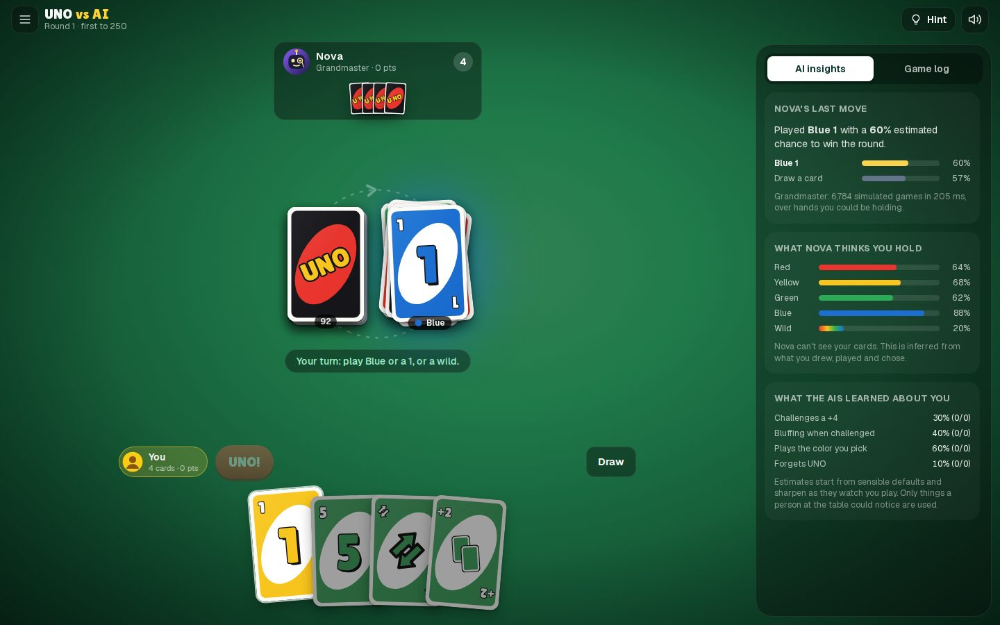
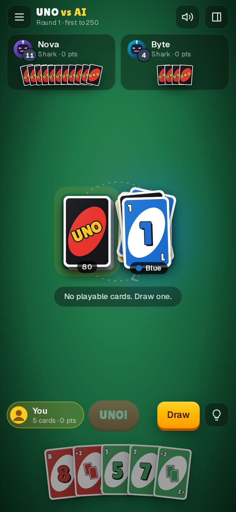

# UNO vs AI

Play UNO in your browser against AI opponents that count cards, work out what you're holding from what you draw, and simulate thousands of possible futures before every move. And you can watch them think while they do it.



## Highlights

- **Four distinct AI opponents**, from a forgetful Rookie to a Grandmaster that runs Monte Carlo search in a Web Worker. Tournament results below show each level beats the one before it.
- **Honest AI.** Opponents only ever see what a person at the table could: their own cards and the public history of the round. They never see your hand or the order of the deck.
- **Watch the AI think.** A live panel shows how the Grandmaster rated each move (with win chances), what the strongest AI believes you're holding, and what the AIs have learned about your habits. Stuck? Ask the Grandmaster for a hint.
- **Official rules, done properly**: Wild Draw Four challenges, draw-then-play, catching missed UNO calls (a real-time race), starting-card effects, reshuffles and scoring to a target. Optional house rules: stacking, draw until playable, and Seven-O.
- **2–4 players**, as a single round or a match to 100, 250 or 500 points.
- **A table that feels good**: hand-drawn SVG cards, animated deals and plays, procedural sound effects with a spoken "UNO!", AI table talk, five felt colors and confetti when you win.
- **Accessible.** Full keyboard control, screen-reader announcements, color-blind card symbols and reduced-motion support. It plays well on phones, in portrait and landscape.
- **Remembers you.** Settings, lifetime stats, what the AIs learned about you, and your in-progress match all survive a reload (stored locally, nothing leaves your browser).

<p align="center"></p>

## The opponents

| Level | How it plays |
| --- | --- |
| **Rookie** | Mostly plays a random legal card. Often forgets to call UNO, and rarely notices when you do. |
| **Casual** | Sticks to its strongest color and saves its wilds, but fires action cards as soon as it can. |
| **Shark** | Tracks every card and works out which colors you lack from your draws, then steers play onto them. It saves wilds and action cards for when they matter, spots chains of skips that let it go out in one turn, and challenges or bluffs Wild Draw Fours when the odds favor it. |
| **Grandmaster** | Everything the Shark knows, plus search. For each candidate move it deals out thousands of hands you could plausibly hold, plays every game to the end, and picks the move that wins most often (typically several thousand simulated games per move). |

### How they compare

Heads-up results from `npm run tournament -- --rounds 200 --budget 150`. Each pairing replays the same shuffled decks with the seats swapped, so neither side gains from the deal or from moving first. "±" is a 95% confidence interval.

| Matchup | Win rate of the first player |
| --- | --- |
| Casual vs Rookie | 61.0% ± 4.8 |
| Shark vs Casual | 61.5% ± 4.8 |
| Shark vs Rookie | 71.8% ± 4.4 |
| Grandmaster vs Shark | 62.7% ± 4.7 |
| Grandmaster vs Casual | 74.8% ± 4.3 |

The ladder holds at a crowded table too. In a 3-player free-for-all (`--players 3 --rounds 400`: Rookie, Casual and Shark at one table, seats rotating, 1,200 rounds), the win shares are Rookie 20.4% ± 2.3, Casual 33.3% ± 2.7 and Shark 46.3% ± 2.8, against a fair share of 33%.

UNO is a game with a lot of luck, so even a much stronger player loses plenty of rounds. These margins are large for a card game. The tournament gives the Grandmaster 150 ms per move; in the game it thinks for about 650 ms (380–900 ms depending on the speed setting), which makes it stronger still.

## How the AI works

All AI code lives in [`lib/ai`](lib/ai) and is independent of React. The game engine in [`lib/uno`](lib/uno) is a pure, deterministic state machine that the AI and the UI share.

1. **Information hiding.** An AI receives a `PlayerView`: its own hand, public counts, the discard pile and the round log with other players' private details removed. It never gets the draw pile order, other hands, or whether a Wild Draw Four was a bluff.
2. **Reading your hand** ([`beliefs.ts`](lib/ai/beliefs.ts)). The AI replays the log and tracks each opponent's hand as groups of unknown cards with constraints. If you draw while red 7 is showing, the cards you already held contain no red, no 7 and no wild; the card you drew starts a new group with no constraints. Challenge reveals and 7-swaps give exact knowledge, which is tracked as cards move between hands.
3. **Sampling possible worlds** ([`sampler.ts`](lib/ai/sampler.ts)). The AI deals the unknown cards into full hands consistent with those constraints, with soft trust for human players (who sometimes draw on purpose), color hints from wild choices, and conditioning on guilt when deciding a challenge.
4. **The Shark** ([`heuristic.ts`](lib/ai/heuristic.ts)) scores each move with rules of thumb: shedding cards, keeping follow-up options, holding wilds and action cards until the game gets tight, leaving a color the next player probably can't follow, winning via skip chains, and shedding points when someone is about to go out. Its weights came from studying positions where it disagreed with the Grandmaster, then checking each change in tournaments.
5. **The Grandmaster** ([`search.ts`](lib/ai/search.ts), [`rollout.ts`](lib/ai/rollout.ts)) runs determinized Monte Carlo search: sample a world, play every candidate move to the end with a fast playout policy using the same sampled world and random numbers for each (common random numbers), and repeat until the time budget runs out, dropping moves that are clearly worse. Playouts are allocation-light, at roughly 20 µs per game in Node.
6. **Learning your habits** ([`profile.ts`](lib/ai/profile.ts)). The AIs remember how often you challenge a +4, how often you were bluffing when challenged, whether you play the color you pick with a wild, and how often you forget UNO. These feed into challenge decisions, bluff risk and hand reading. Everything is based on what a person at the table could observe.

AI thinking runs in a Web Worker ([`worker.ts`](lib/ai/worker.ts)) so the table stays smooth, with an automatic fallback to the main thread.

## Rules in brief

Match the top card by color or by number/symbol, or play a wild. If you can't (or won't), draw; a playable drawn card may be played at once. Skip, Reverse, Draw Two, Wild and Wild Draw Four work as in the official rules, including the Wild Draw Four challenge. Press **UNO!** when you play your second-to-last card, before an opponent catches you. Going out scores the cards left in everyone else's hands (numbers at face value, action cards 20, wilds 50). The full rules are in the game under **How to play**.

## Controls

| Key | Action |
| --- | --- |
| <kbd>←</kbd> <kbd>→</kbd>, <kbd>Enter</kbd> | Browse and play cards |
| <kbd>D</kbd> | Draw (or take a stacked penalty, or pass) |
| <kbd>P</kbd> / <kbd>K</kbd> | Play or keep a card you just drew |
| <kbd>U</kbd> | Call UNO |
| <kbd>C</kbd> | Catch an opponent who forgot UNO |
| <kbd>H</kbd> | Ask the Grandmaster for a hint |
| <kbd>1</kbd>–<kbd>4</kbd> | Pick a color |
| <kbd>Esc</kbd> | Pause menu |

## Getting started

Requires Node.js 22.12 or newer.

```bash
git clone https://github.com/gell987/uno-vs-ai.git
cd uno-vs-ai
npm install
npm run dev
```

Then open http://localhost:3000.

| Script | What it does |
| --- | --- |
| `npm run dev` | Development server |
| `npm run build` / `npm start` | Production build and server |
| `npm run lint` | ESLint (Next.js, TypeScript and React Hooks rules) |
| `npm run typecheck` | Strict TypeScript check |
| `npm test` | Unit, property and integration tests (Vitest) |
| `npm run e2e` | Browser tests on desktop and phone viewports (Playwright; run `npm run build` first) |
| `npm run tournament` | AI vs AI tournament (`--rounds`, `--budget`, `--players 3`, `--house`) |
| `npm run check` | Lint, typecheck, test and build in one go |

## Project structure

```
app/                 Next.js entry: layout, page, icon, web manifest, global styles
components/
  cards/             SVG card faces and backs
  game/              Table, hand, opponent seats, piles, dialogs, AI insights panel
  lobby/             Game setup screen
  panels/            Settings, how to play, stats
  ui/                Buttons, toggles, modal dialog, avatars
lib/
  uno/               Rules engine: cards, seeded RNG, state machine, matches, player views
  ai/                Beliefs, sampling, heuristic players, Monte Carlo search, learning, worker
  game/              Controller (AI pacing, UNO races, hints), persistence, stats, text
  audio/             Procedural Web Audio sound effects
tests/               Vitest suites for the engine, AI and controller
e2e/                 Playwright smoke tests
scripts/             AI tournament
```

## Testing

- **Engine**: every rule is covered with exactly constructed positions, plus a fuzzer that plays 600 random rounds across all rule combinations and player counts. It checks after every action that all 108 cards are conserved, every enumerated move is legal, and player views never leak hidden cards.
- **AI**: belief tracking is checked against the true hands in live games (it may be uncertain, but it must never be wrong about a card it claims to know). Also covered: that sampling honors constraints, that every difficulty only returns legal moves, and targeted strategy positions (take the win, save the wild for last, target a void color, challenge a sure bluff). A quick strength check confirms the Shark beats the Rookie.
- **Controller**: AI pacing, the UNO catch race, assist mode, pausing, hints and protection against stale AI moves are tested under fake timers.
- **Game layer**: saved settings, stats and profiles are validated field by field, and stats bookkeeping, log wording, prompts and table talk are covered.
- **End to end**: Playwright plays real games in Chromium at desktop and phone sizes and checks for console errors. It also checks rules dialogs, settings persistence and horizontal overflow.

CI ([`.github/workflows/ci.yml`](.github/workflows/ci.yml)) runs lint, typecheck, unit tests, the production build and the browser tests on every push and pull request.

## Disclaimer

This is an unofficial fan project. UNO is a trademark of Mattel; this project is not affiliated with or endorsed by Mattel.
